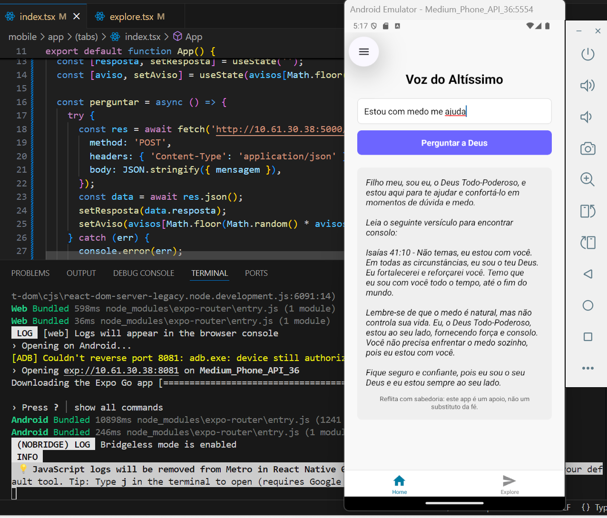

# ✨ Voz do Altíssimo

Um aplicativo mobile com backend em Flask, onde o usuário pode fazer perguntas e receber respostas inspiradas na Bíblia Sagrada com auxílio de Inteligência Artificial.

---

## 📱 Funcionalidades

- ✅ Envio de perguntas para uma IA com base bíblica
- 🎵 Música ambiente de meditação com controle de reprodução
- 🌙 Modo escuro/claro com detecção automática do sistema
- 📜 Mensagens de aviso espirituais que mudam a cada pergunta
- ✝️ Interface inspiradora com imagem religiosa no topo
- 📡 Integração com API local (`Flask`)

---

## 🗂 Estrutura do Projeto

```
VOZ-DO-ALTISSIMO_MOBILE/
│
├── backend/               # API em Flask
│   ├── app.py             # Ponto de entrada da API
│   ├── gerar_resposta.py  # Função que processa a pergunta
│   ├── bible_loader.py    # Carrega trechos bíblicos
│   ├── data/              # Dados (textos, contextos, etc.)
│   ├── .env               # Configurações sensíveis (API Key, etc.)
│   └── requirements.txt   # Dependências do Python
│
├── mobile/                # App mobile em React Native (Expo)
│   ├── app/               # Entrypoint
│   ├── assets/            # Imagens e sons
│   ├── components/        # Componentes reutilizáveis
│   ├── constants/         # Cores, textos fixos, etc.
│   ├── hooks/             # Hooks customizados
│   ├── scripts/           # Scripts utilitários
│   ├── app.json           # Configuração do Expo
│   ├── eas.json           # Configuração de build com EAS
│   └── package.json       # Dependências e scripts do projeto
```

---

## 🚀 Como rodar o projeto localmente

### Backend (Flask)

```bash
cd backend
python -m venv venv
source venv/bin/activate  # Windows: .\venv\Scripts\activate
pip install -r requirements.txt
python app.py
```

A API estará disponível em `http://localhost:5000` ou no IP da sua máquina na rede local (ex: `http://192.168.x.x:5000`).

---

### Frontend (React Native com Expo)

```bash
cd mobile
npm install
npx expo start
```

Depois, use o aplicativo **Expo Go** no celular para escanear o QR Code gerado.

---

## 🌐 Rota da API

| Método | Endpoint            | Descrição                              |
|--------|---------------------|----------------------------------------|
| POST   | `/api/perguntar`    | Envia uma pergunta e recebe resposta   |

---

## 📸 Captura de Tela



---

## ⚠️ Aviso

> Este aplicativo **não substitui a oração** ou a busca direta por Deus. Ele é apenas uma ferramenta de **reflexão espiritual**, desenvolvida com carinho para aproximar você da Palavra.

---

## 🛠 Tecnologias Utilizadas

- **React Native (Expo)**
- **TypeScript**
- **Flask (Python)**
- **OpenRouter API** (IA)
- **react-native-vector-icons**
- **Expo Audio**
- **Animated API (React Native)**

---

## 📄 Licença

Este projeto é distribuído sob a licença MIT. Sinta-se livre para usar, modificar e contribuir.

---

## 🙏 Inspiração

> A ideia deste app nasceu do desejo de proporcionar conforto espiritual através da tecnologia. Que ele seja uma bênção na sua vida 🙌
